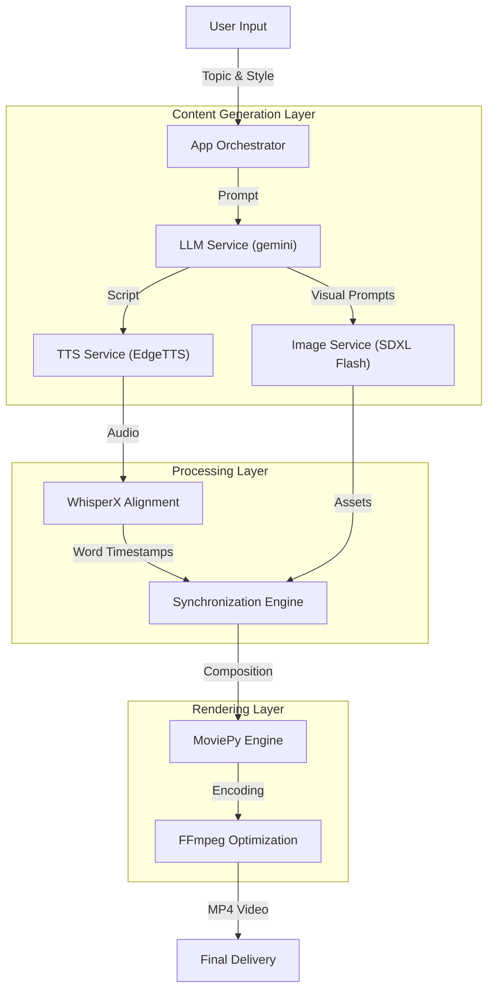

# AutoStream: Autonomous AI Video Generation Pipeline


**AutoStream** is an end-to-end engineered pipeline that converts a simple text prompt into a fully produced narrative video. Unlike simple model wrappers, this system orchestrates multiple AI agents (LLMs, TTS, Diffusion, ASR) to script, narrate, visualize, and edit video content autonomously.

🔗 **Live Demo:** [Hugging Face Space](https://huggingface.co/spaces/NexusAI4/TTV_App)

---

## 🏗 System Architecture

The pipeline follows a modular micro-service architecture wrapped in a containerized environment. It decouples the generative logic from the video rendering engine to ensure scalability.



---

## 🚀 Key Engineering Features

### 1. High-Performance Inference & Latency Optimization
- **LLM Engine:** Utilizes **gemini API** with `gemini` to achieve sub-second script generation, significantly reducing the "Time to First Token."
- **Visual Synthesis:** Implements **SDXL-Flash** via the Hugging Face Inference Client. This model was selected for its ability to generate high-fidelity images in <8 steps, optimized for T4 GPU execution.
- **Redundancy:** Includes a fallback image generation service (`pollinations.py`) to ensure pipeline stability if the primary inference API is rate-limited.

### 2. Precise Audio-Visual Synchronization (Forced Alignment)
- **Problem:** Standard TTS engines provide audio but lack precise timing data for subtitles.
- **Solution:** The pipeline integrates **WhisperX** (OpenAI Whisper with Phoneme Alignment). It processes the generated audio to extract word-level timestamps, allowing for millisecond-precision subtitle burning that matches the speech perfectly.

### 3. Production-Ready Infrastructure
- **Dockerized Environment:** A custom `Dockerfile` handles complex OS-level dependencies (`imagemagick`, `ghostscript`, `ffmpeg`) often missing in standard Python environments.
- **Policy Management:** Automates the configuration of ImageMagick security policies (`policy.xml`) to permit text rendering on Linux containers.
- **Asset Management:** A dedicated `MediaUtils` class handles the downloading, verification, and caching of fonts and background music to prevent runtime IO errors.

---

## 📂 Project Structure

```text
/
├── Dockerfile              # Container definition with OS dependencies
├── app.py                  # Gradio UI & Application Entry Point
├── services/               # Microservices Logic
│   ├── genai_service.py    # LLM Interaction (Gemini)
│   ├── speech_service.py   # TTS Generation (EdgeTTS)
│   ├── video_service.py    # Video Compositing (MoviePy)
│   ├── whisperx_service.py # Audio Alignment (WhisperX)
│   └── ai_image_generator/ # Pluggable Image Models
│       ├── sdxl_flash_hf.py
│       └── pollination.py
├── utils/                  # Helper Utilities
│   ├── media_utils.py      # Asset download/verification
│   └── file_utils.py       # IO operations
├── fonts/                  # Custom typography assets
├── bg_music/               # Background audio tracks
├── requirements.txt        # Python dependencies (pinned)
└── packages.txt            # System dependencies (apt-get)
```

---

## 🛠️ Tech Stack

| Component | Technology | Rationale |
| :--- | :--- | :--- |
| **Orchestration** | Python 3.10, Gradio | Rapid UI prototyping and async capability. |
| **Scripting** | gemini | Lowest latency LLM for real-time generation. |
| **Audio** | EdgeTTS | Natural sounding neural voices with zero latency. |
| **Alignment** | WhisperX | State-of-the-art forced alignment for accurate subtitles. |
| **Visuals** | SDXL Flash | High-speed diffusion models optimized for T4 GPUs. |
| **Editing** | MoviePy, FFmpeg | Programmatic non-linear editing (NLE). |

---

## 💻 Local Installation

To run this pipeline locally, you must have `ffmpeg` and `imagemagick` installed on your system.

**1. Clone the Repository**
```bash
git clone https://github.com/ShubhankarRawat/TTV-App-V1.git
cd TTV-App-V1
```

**2. System Dependencies (Ubuntu/Debian)**
```bash
sudo apt-get update && sudo apt-get install ffmpeg imagemagick ghostscript
```

**3. Install Python Dependencies**
```bash
# Recommended to use a virtual environment
pip install -r requirements.txt
```

**4. Environment Configuration**
Create a `.env` file in the root directory:
```bash
HF_TOKEN=your_huggingface_token_here
gemini_API_KEY=your_gemini_api_key_here
```

**5. Run the App**
```bash
python app.py
```

---

## 🐳 Docker Deployment

The recommended way to run the application to ensure all system dependencies are met.

```bash
# Build the image
docker build -t autostream-app .

# Run the container (Map port 7860)
docker run -it -p 7860:7860 --env-file .env autostream-app
```

---

## 🔮 Future Roadmap

- [ ] **Vector Database Integration:** To allow RAG-based video generation from PDF documents.
- [ ] **Asynchronous Queueing:** Implementing Celery/Redis for handling concurrent user requests.
- [ ] **Multi-Speaker Support:** Diarization to assign different AI voices to different characters in the script.

---

### Author
**Shubhankar Rawat** *AI Engineer & Researcher* [LinkedIn](https://linkedin.com/in/shubhankar-rawat) | [Portfolio](https://shubhankarrawat.github.io)
